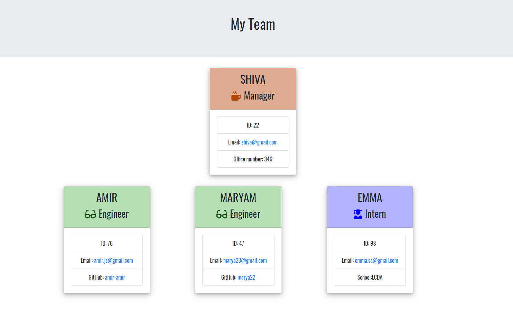

<h1 align="center"> Welcome to Team-Profile Generator👋</h1>

 

## Description 

A Node command-line application that uses inquirer and takes in information about employees and generates an HTML webpage that displays summaries for each person in team.The team.html file is created in the output directory and can be found [here](https://drive.google.com/file/d/1BjjBA9G24L1pKCoRnIfCp7WoI2N8dJM1/view)

## ✨Demo

 ## Table of Contents
* [Description](#Description)
* [Installation](#installation)
* [Usage](#usage)
* [license](#license)

## Installation
*Steps required to install project and how to get the development environment running:*

    1-Download or clone this repository into your local computer.
    2-In your terminal, browse to the folder and run npm install --production.

## 💻usage
*Instructions and examples for use:*  
When you run node index.js, the application uses the inquirer package to prompt you in the command line with a series of questions about your Team members.

Application will be invoked by using the following command:

    node app.js

The user will be prompted for information to select employee type

    Manager (only one is allowed to be added)
    Engineer (any number)
    Intern (any number)
All employee will be asked the following information, all prompts are validated to ensure appropriate input to generate the correct output

    Name
    ID
    Email
Depending on employee role, additional prompts are presented

    Manager - office number
    Engineer - GitHub username
    Intern - school
Then a team.html page will be generated in the output directory, that displays a nicely formatted team roster.
      
## Features

    JavaScript
    Node.js
    jest
    npm
      
## 📝License
MIT License 
       

## Questions
 :octocat: Find me on GitHub:[shiva-shiva](https://github.com/shiva-shiva) 
     
    ✉️ Email me with any questions: shivasabokdast@gmail.com  